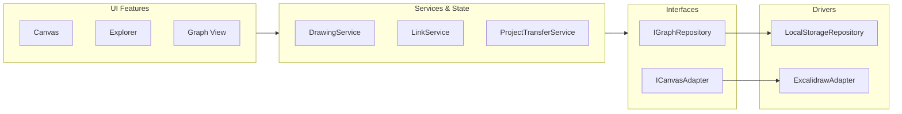

# LinkDraw Architecture

## Overview

LinkDraw extends Excalidraw with multi-canvas project management, inter-drawing element relationships, graph visualization, and wiki-style references. The codebase is designed around Clean Architecture principles, ensuring strict separation of concerns, inward dependency flow, and explicit extension interfaces.

---

## Design Principles

1. **Feature-based Organization**: Code is organized by domain functionality (`features/canvas`, `features/explorer`, `features/graph`), not by arbitrary technical file types.
2. **Interface Abstraction at Integration Boundaries**: Explicit interfaces (`IGraphRepository`, `ICanvasAdapter`) decouple core domain logic from external libraries (Excalidraw, localStorage, IndexedDB, Cytoscape).
3. **Inward Dependencies**: UI features depend on shared services and interfaces; shared modules never depend on UI features.
4. **Resilient Data Contracts**: Project backup schemas (`LinkDrawProjectBackup`) strictly validate parent structures, circular dependencies, and duplicate identifiers before persistence operations.

---

## Architecture Layers



---

## Directory Layout

```
src/
├── features/                 # Domain Feature Modules
│   ├── canvas/              # Canvas engine UI, loaders & wiki autocomplete
│   │   ├── components/      # GlobalWikiModal, DrawingPickerModal, LinkButton
│   │   ├── hooks/           # useCanvasLoader, useAutoSave, useElementSelection
│   │   └── Canvas.tsx
│   ├── explorer/            # Tree explorer & sidebar navigation
│   │   ├── components/      # TreeNode, ExplorerToolbar, ExplorerMenuModal, BacklinksPanel
│   │   ├── hooks/           # useDragAndDrop, useTreeNode
│   │   └── Explorer.tsx
│   └── graph/               # Document link graph visualization
│       ├── components/      # GraphHeader, GraphView
│       └── Graph.tsx
│
├── shared/                  # Shared Domain Infrastructure
│   ├── adapters/            # External library wrappers
│   │   └── excalidraw/      # ExcalidrawAdapter implementation
│   ├── components/          # Reusable UI (Icon, ConfirmModal, Toast, DropdownMenu)
│   ├── constants/           # Shared layout and theme constants
│   ├── hooks/               # Custom hooks (useKeyboardShortcuts, useAutoSave)
│   ├── interfaces/          # Domain contracts (IGraphRepository, ICanvasAdapter)
│   ├── lib/                 # Pure helper functions (drawing-links, tree-utils)
│   ├── repositories/        # Persistence adapters (LocalStorageRepository)
│   ├── services/            # Core business logic
│   │   ├── DrawingService.ts
│   │   ├── LinkService.ts
│   │   └── ProjectTransferService.ts
│   ├── store/               # Zustand global state (drawingStore, treeStore, themeStore)
│   └── types/               # Domain type definitions (drawing.ts, backup.ts)
│
└── App.tsx                  # Root application layout
```

---

## Core Domain Interfaces

### 1. `IGraphRepository` (Persistence abstraction)

Allows replacing local storage with IndexedDB or a remote GraphQL/REST API backend without altering business logic:

```typescript
export interface IGraphRepository {
  createDrawing(title: string, parentId?: string | null): Promise<string>
  saveDrawing(id: string, data: DrawingInput): Promise<void>
  loadDrawing(id: string): Promise<Drawing | null>
  deleteDrawing(id: string): Promise<void>
  listDrawings(): Promise<Drawing[]>
  getDrawingsTree(): Promise<DrawingTreeNode[]>
  setDrawingParent(id: string, parentId: string | null): Promise<void>
  updateDrawingTitle(id: string, title: string): Promise<void>
  getDrawingSummaries(): Promise<DrawingSummary[]>
  duplicateDrawing(id: string, includeChildren: boolean): Promise<string>
  replaceAllDrawings(drawings: Drawing[]): Promise<void>
}
```

### 2. `ICanvasAdapter` (Canvas engine abstraction)

Decouples Excalidraw's API lifecycle from LinkDraw's application logic:

```typescript
export interface ICanvasAdapter {
  setAPI(api: ExcalidrawImperativeAPI): void
  getContent(): ExcalidrawContent
  setContent(content: ExcalidrawContent): void
  onChange(callback: (content: ExcalidrawContent) => void): () => void
  scrollToElement(elementId: string): void
  highlightElement(elementId: string): void
  hasUnsavedChanges(): boolean
  markAsSaved(): void
}
```

### 3. `ProjectTransferService` (Import/Export & Validation)

Provides standardized schema import/export with multi-level verification:

- **JSON Parsing & Format Verification**: Supports unified `linkdraw-project` v1 schema and legacy formats (`1.0.0` or direct `Drawing[]` arrays).
- **Structure Check**: Validates each drawing item's `id`, `title`, and `content.elements`.
- **ID Uniqueness**: Rejects duplicate IDs in imported files.
- **Parent Resolution**: Checks that all `parent_id` entries reference valid drawings inside the backup set.
- **Circular Reference Prevention**: Executes depth-first tree traversal to detect and prevent circular parent loops.
- **Recovery Safety**: Creates a `sessionStorage` recovery snapshot before executing atomic `replaceAllDrawings`.

---

## Auto-Save & Synchronization Strategy

1. **Debounced Saves**: `useAutoSave` applies a 500ms delay after canvas edits to minimize write amplification.
2. **State Protection (`isImporting`)**: When `ProjectTransferService` performs an import, `isImporting` is set to `true` in `useDrawingStore`. This disables `useAutoSave` and clears `useCanvasLoader` caches (`clearCache()`), eliminating race conditions where debounced saves overwrite freshly imported project data.
3. **Canvas Loader Cache**: During inter-drawing navigation, unsaved modifications are cached in `contentCacheRef` to guarantee zero data loss.

---

## Testing Architecture

The codebase features **126 automated unit & integration tests** executed via Vitest and Happy DOM:

- **Services**: `ProjectTransferService`, `DrawingService`, `LinkService`, and graph algorithms.
- **Adapters**: `ExcalidrawAdapter` API wrapping and element highlighting.
- **Utilities**: Tree hierarchy utilities (`tree-utils`), link URI parsers (`drawing-links`), unique name generators (`drawing-names`).
- **Hooks & Components**: `useAutoSave`, `useTreeNode`, `BacklinksPanel`, `GlobalWikiModal`.

```bash
pnpm test -- --run
```
