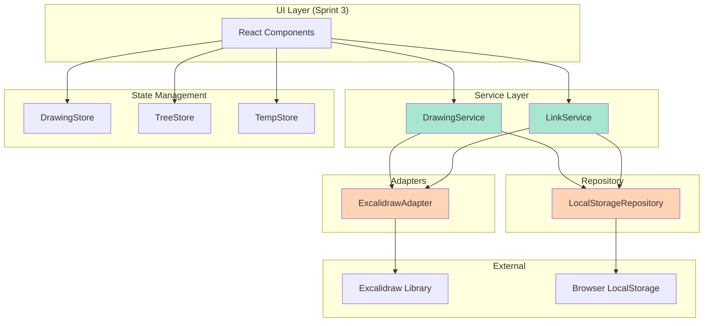
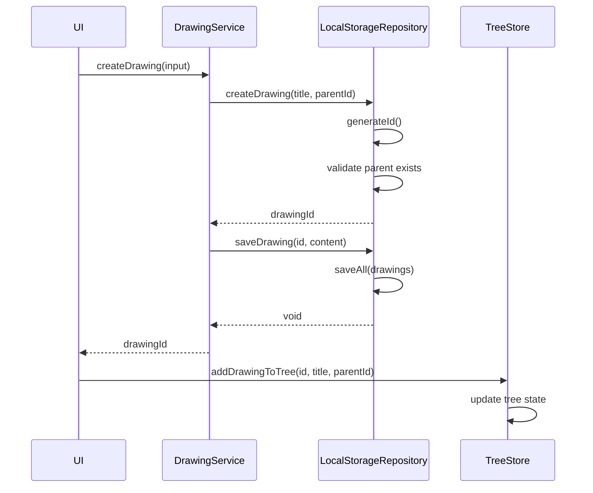
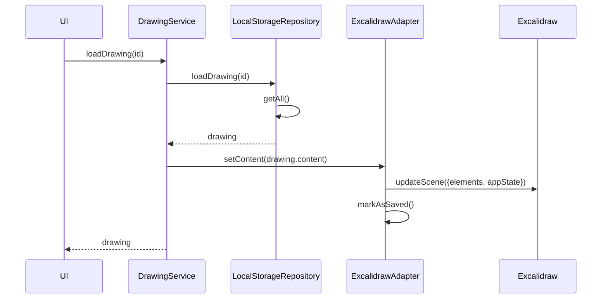
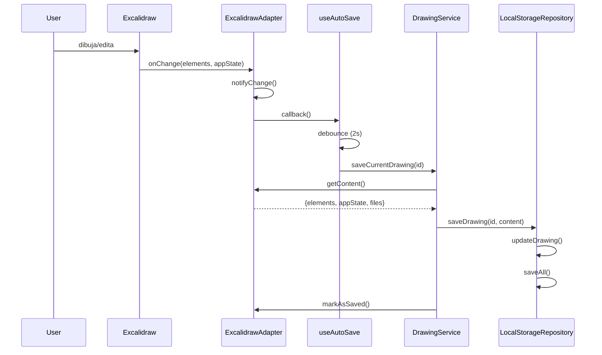
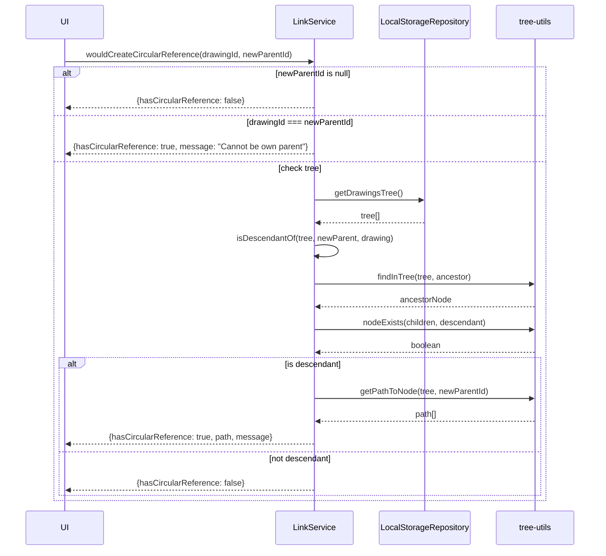
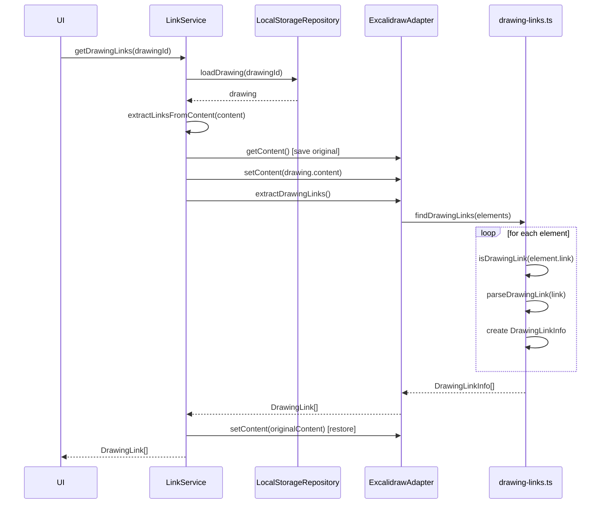

# Excaligraph - Arquitectura Core (Sprint 1 & 2)

## 🏗️ Arquitectura General



---

## 📦 Capas de la Arquitectura

### **1. Repository Layer** (Persistencia)
```
src/shared/repositories/
└── localStorage/
    ├── LocalStorageRepository.ts    # Implementa IGraphRepository
    └── helpers/
        ├── tree-builder.ts          # Construye árbol de drawings
        └── circular-validator.ts    # Valida referencias circulares
```

**Responsabilidad**: Abstraer el acceso a datos
- CRUD de drawings
- Construcción de árbol jerárquico
- Validación de integridad

---

### **2. Adapter Layer** (Integración Externa)
```
src/shared/adapters/
└── excalidraw/
    └── ExcalidrawAdapter.ts         # Implementa ICanvasAdapter
```

**Responsabilidad**: Adaptar Excalidraw a nuestra interfaz
- Gestión de elementos del canvas
- Extracción de links
- Detección de cambios
- Callbacks de eventos

---

### **3. Service Layer** (Lógica de Negocio)
```
src/shared/services/
├── DrawingService.ts                # Orquesta CRUD y canvas
├── LinkService.ts                   # Gestiona links y ciclos
└── link/
    └── graph-algorithms.ts          # Algoritmos de grafos (DFS)
```

**Responsabilidad**: Coordinar operaciones complejas
- Orquestar Repository + Adapter
- Validar reglas de negocio
- Detectar referencias circulares

---

### **4. State Management** (Estado Global)
```
src/shared/store/
├── drawingStore.ts                  # Títulos, navegación, focus
├── treeStore.ts                     # Operaciones de árbol
├── tempStore.ts                     # Drawings temporales
└── graphStore.ts                    # Barrel export
```

**Responsabilidad**: Estado reactivo de la UI
- Optimistic UI updates
- Gestión de temporales
- Navegación activa

---

## 🔄 Flujos Principales

### **Flujo 1: Crear Drawing**



**Pasos**:
1. UI llama a `DrawingService.createDrawing()`
2. Service crea el drawing en el repository
3. Service guarda el contenido
4. UI actualiza el store para optimistic UI

---

### **Flujo 2: Cargar Drawing en Canvas**



**Pasos**:
1. UI solicita cargar un drawing
2. Service lo obtiene del repository
3. Service lo carga en el adapter
4. Adapter actualiza Excalidraw
5. Marca como guardado (sin cambios)

---

### **Flujo 3: Auto-Save**



**Pasos**:
1. Usuario edita en Excalidraw
2. Excalidraw dispara onChange
3. Adapter notifica a los callbacks
4. Hook de auto-save espera 2s (debounce)
5. Service guarda el contenido
6. Marca como guardado

---

### **Flujo 4: Detección de Referencias Circulares**



**Algoritmo**:
1. Valida casos triviales (null, self-reference)
2. Obtiene el árbol de drawings
3. Busca si el nuevo padre es descendiente del drawing
4. Si es descendiente → circular reference
5. Retorna resultado con path si hay ciclo

---

### **Flujo 5: Extraer Links de Drawing**



**Pasos**:
1. Service carga el drawing
2. Guarda contenido actual del canvas
3. Carga contenido del drawing temporalmente
4. Extrae links usando utilidades
5. Restaura contenido original
6. Retorna links encontrados

---

## 🗂️ Estructura de Datos

### **Drawing**
```typescript
interface Drawing {
  id: string                    // UUID
  title: string                 // "Mi Diagrama"
  content: ExcalidrawContent    // {elements, appState, files}
  parent_id: string | null      // Jerarquía
  is_public: boolean
  created_at: string            // ISO timestamp
  updated_at: string            // ISO timestamp
}
```

### **DrawingTreeNode**
```typescript
interface DrawingTreeNode extends Drawing {
  children?: DrawingTreeNode[]  // Árbol recursivo
}
```

### **DrawingLink**
```typescript
interface DrawingLink {
  elementId: string             // ID del elemento con el link
  targetDrawingId: string       // ID del drawing destino
  targetType: "drawing" | "element" | "frame"
}
```

---

## 🔗 Formato de Links

```
drawing://[drawingId]                    → Link a drawing completo
drawing://[drawingId]#element:[elementId] → Link a elemento específico
drawing://[drawingId]#frame:[frameId]     → Link a frame específico
```

**Ejemplo**:
```
drawing://abc123
drawing://abc123#element:xyz789
drawing://abc123#frame:frame-001
```

---

## 🎯 Patrones de Diseño Utilizados

### **1. Repository Pattern**
- `IGraphRepository` abstrae persistencia
- Permite cambiar de localStorage a Firebase sin cambiar servicios

### **2. Adapter Pattern**
- `ExcalidrawAdapter` adapta API de Excalidraw
- Permite cambiar de librería de canvas sin cambiar servicios

### **3. Service Layer Pattern**
- `DrawingService` y `LinkService` encapsulan lógica de negocio
- Orquestan Repository + Adapter

### **4. Dependency Injection**
- Servicios reciben dependencias en constructor
- Facilita testing y flexibilidad

### **5. Observer Pattern**
- `ExcalidrawAdapter` usa callbacks (onChange, onSave)
- Hooks de React se suscriben a cambios

---

## 📊 Complejidad de Operaciones

| Operación | Complejidad | Notas |
|-----------|-------------|-------|
| `createDrawing` | O(n) | Validar parent existe |
| `loadDrawing` | O(n) | Buscar en array |
| `getDrawingsTree` | O(n) | Construir árbol con Map |
| `setDrawingParent` | O(d) | d = profundidad del árbol |
| `getDrawingSummaries` | O(n) | Con Set para hasChildren |
| `wouldCreateCircularReference` | O(d) | Caminar hacia arriba |
| `detectCycle` (links) | O(V + E) | DFS en grafo |
| `getBacklinks` | O(n) | Iterar todos los drawings |

**Optimizaciones aplicadas**:
- ✅ Uso de `Map` para lookups O(1)
- ✅ Uso de `Set` para checks O(1)
- ✅ Evitar iteraciones anidadas
- ✅ Extracción de links sin I/O repetido

---

## 🚀 Preparado para Sprint 3

**Lo que tenemos**:
- ✅ Persistencia funcionando (LocalStorage)
- ✅ Adaptador de Excalidraw
- ✅ Servicios con lógica de negocio
- ✅ State management con Zustand
- ✅ Detección de ciclos
- ✅ Auto-save hooks

**Lo que falta (Sprint 3)**:
- ⏳ Componentes de UI
- ⏳ Integración de servicios con UI
- ⏳ Navegación entre drawings
- ⏳ Visualización del árbol
- ⏳ Canvas con Excalidraw

---

## 📝 Notas de Implementación

### **Decisiones Clave**

1. **LocalStorage como primera implementación**
   - Rápido para desarrollo
   - Fácil de debuggear
   - Preparado para migrar a Supabase

2. **Links almacenados en contenido**
   - No hay tabla separada de links
   - Se extraen on-demand del contenido
   - Simplifica la implementación inicial

3. **Stores divididos por dominio**
   - `drawingStore`: UI state (títulos, navegación)
   - `treeStore`: Operaciones de árbol
   - `tempStore`: Drawings temporales
   - Cada uno < 200 líneas

4. **Mutación de canvas encapsulada**
   - `extractLinksFromContent()` es privado
   - Guarda/restaura estado del canvas
   - Evita efectos secundarios visibles

5. **Validación en múltiples capas**
   - Repository: Valida integridad de datos
   - Service: Valida reglas de negocio
   - UI: Validación de formularios (Sprint 3)

---

**Arquitectura sólida y lista para construir la UI** 🎯
